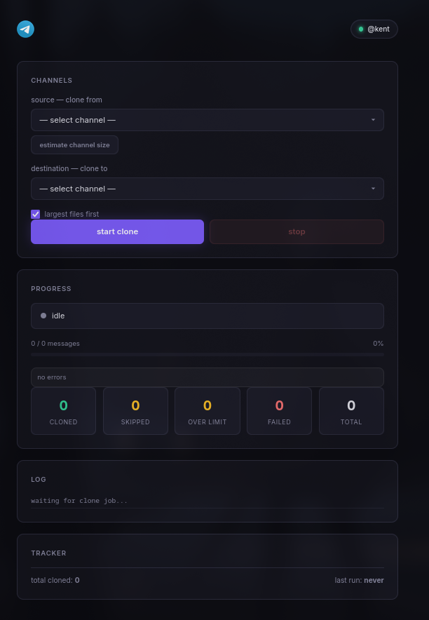

# Telegram Channel & Topic Cloner / Forwarder 🚀

A high-speed, feature-rich Telegram channel & forum topic forwarder with server-side forwarding, anti-ban pacing, batch execution, and a modern glassmorphism web dashboard.



---

## ✨ Features

- **⚡ Server-Side Plain Forwarding**: Direct server-side forwarding via `ForwardMessagesRequest`. Zero local disk downloads, zero bandwidth waste, original media quality.
- **📌 Forum Topic Routing**: Filter and target specific topic threads inside Telegram Forum Supergroups.
- **🚀 High-Speed Batch Engine**: Sends messages in batches of up to 100 per API request (50x-100x faster than single-message forwarding).
- **🛡️ Anti-Ban Batch Pacing**: Configurable inter-batch delays (default: `5.0s`) to stay safe from Telegram rate limits or bans.
- **⏸️ Automatic Pause & Resume**: All progress is stored in a tracker database. If stopped or restarted, it skips already-sent items and resumes from the exact position where it was paused.
- **🔒 SQLite WAL Concurrency**: Auto-patches SQLite connections with WAL journal mode & 60s busy timeouts to prevent database locks.
- **🎨 Glassmorphism Web Dashboard**: Dark-mode web interface with real-time SSE progress updates, log streaming, and interactive transfer mode tiles.

---

## 🚀 Quick Start

### 1. Installation

Clone the repository and install dependencies:

```bash
# Using standard virtual environment
python -m venv .venv
source .venv/bin/activate  # On Windows: .\.venv\Scripts\activate
pip install -r requirements.txt
```

or using `uv`:
```bash
uv sync
```

### 2. Configuration

Copy `.env.example` to `.env` and fill in your Telegram API credentials (get them from [my.telegram.org](https://my.telegram.org)):

```env
API_ID=12345678
API_HASH=your_api_hash_here
PHONE=+1234567890
```

---

## 💻 Usage

### Web Interface (Default)

Launch the web application:

```bash
python src/Telegram-old-chat-cloner/main.py
```

Open **`http://localhost:5000`** in your browser to access the dashboard.

### Command-Line Interface (CLI)

Run in CLI mode:

```bash
# Interactive CLI mode
python src/Telegram-old-chat-cloner/main.py --cli

# High-speed batch forward with anti-ban pacing (100 msgs/batch, 5s delay)
python src/Telegram-old-chat-cloner/main.py --cli --mode forward --batch-delay 5.0 --max-messages 100

# Clone specific forum topics
python src/Telegram-old-chat-cloner/main.py --cli --source-topic 7 --dest-topic 12
```

---

## 🐳 Docker Usage

Build the image:
```bash
docker build -t telegram-clone .
```

Run the container:
```bash
docker run -it --rm \
  --env-file .env \
  -p 5000:5000 \
  -v $(pwd):/app \
  Telegram-old-chat-cloner
```

---

## 📜 License

MIT License.
